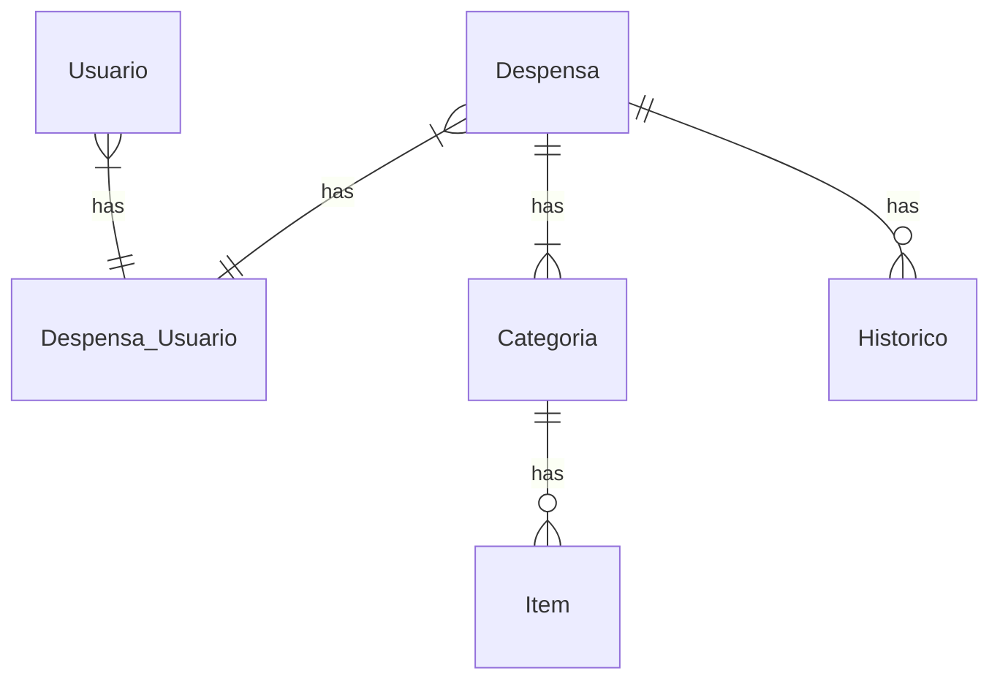
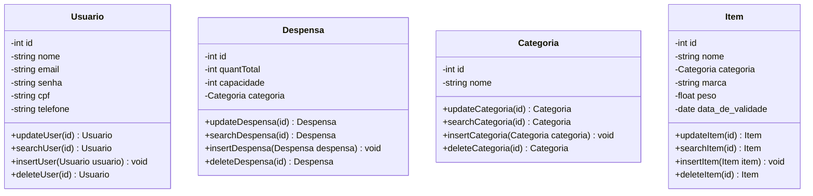

## Documento de Modelos

Neste documento temos o modelo Conceitual (UML) ou de Dados (Entidade-Relacionamento). Temos também a descrição das entidades.

## Descrição das Entidades 

| Entidade      | Descrição                                               |
|---------------|---------------------------------------------------------|
| Usuario       | Entidade  que representa o usuario do sistema           |
| Despensa      | Entidade  que respresenta a despensa, o local onde serão armazenados os itens                              |
| Categoria     | Entidade  que respresenta uma categoria que será atribuida a um item                |
| Item          | Entidade  que respresenta um item, um produto                               |
| Histórico     | Entidade  que respresenta   o relatório da despensa, a movimentação dos itens                          |

## Modelo de Dados (Entidade-Relacionamento)

## Modelo Conceitual

