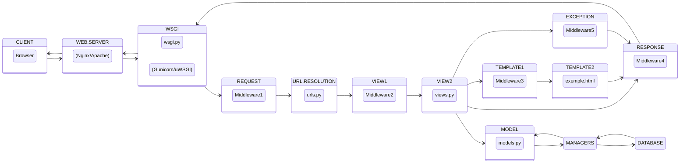

# Projeto Arquitetural - SIGDESPENSA 

Neste documento mostraremos o projeto arquitetural do sistema com uma breve descrição de cada componente utilizado.

## Diagrama 

## Descrição

| Componente | Tecnologia | Descrição
|------------|------------|----------
|View|ReactJS| Criação de componentes visuais para a tela
|Service|Axios| Comunicação via HTTP com a API
|Controller| Express| Servidor para receber as requisições HTTP
|Repository| PrismaJS| ORM para fazer comunicação com o banco de dados
|Database|PostgreSQL| Banco de dados para guardar as informações salvas
