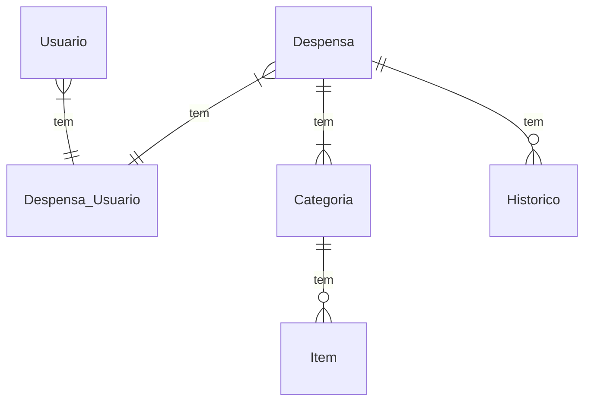

## Documento de Modelos

Neste documento temos o modelo Conceitual (UML) ou de Dados (Entidade-Relacionamento). Temos também a descrição das entidades e o dicionário de dados.

## Descrição das entidades 

| Entidade      | Descrição                                               |
|---------------|---------------------------------------------------------|
| Usuario       | Entidade  que representa o usuario do sistema           |
| Despensa      | Entidade  que respresenta                               |
| Categoria     | Entidade  que respresenta                               |
| Item          | Entidade  que respresenta                               |
| Histórico     | Entidade  que respresenta                               |

## Modelo de Dados (Entidade-Relacionamento)

